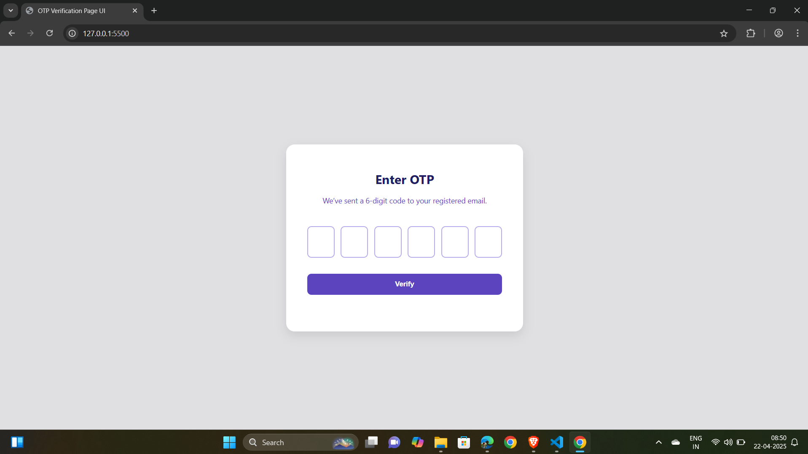
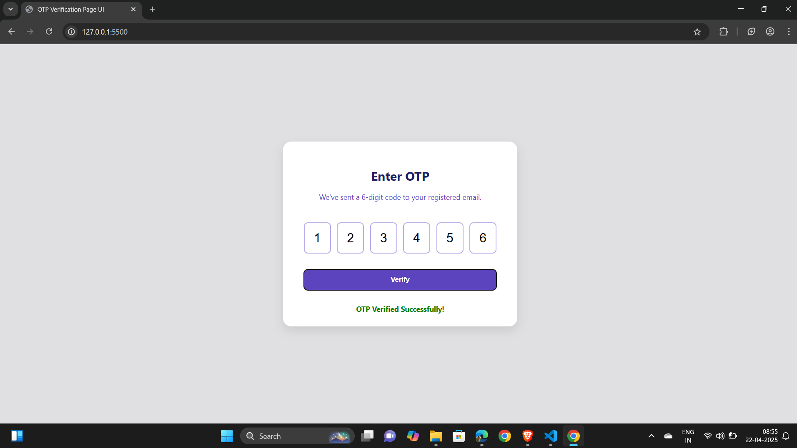
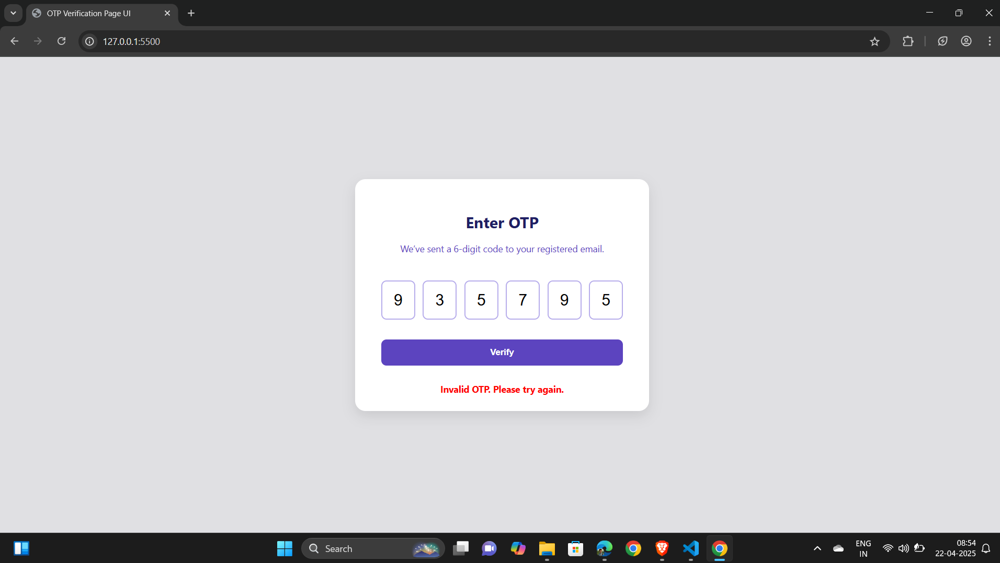
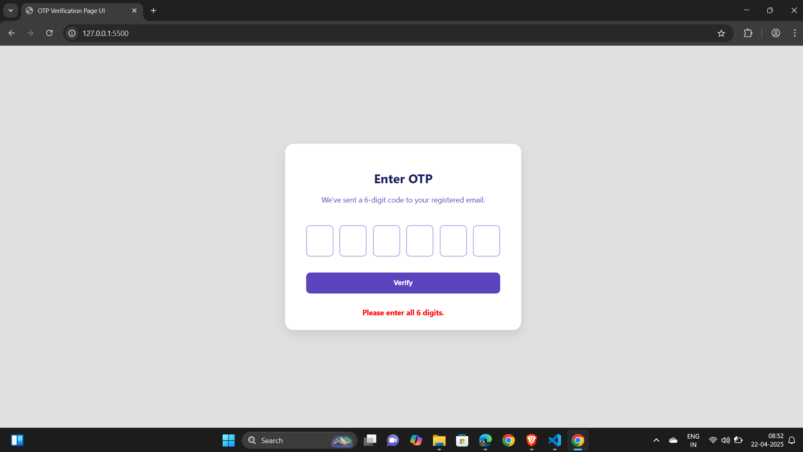
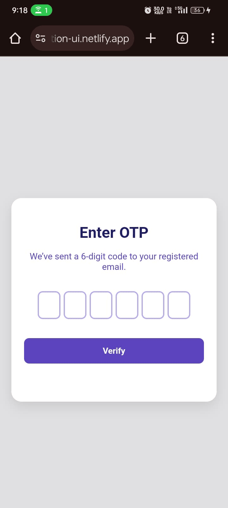

# OTP Verification UI

A responsive and user-friendly OTP (One-Time Password) verification interface built with **HTML**, **CSS**, and **JavaScript**.

## Features

- 🔢 Separate input fields for 6-digit OTP
- 🎯 Auto-focus & smooth navigation
- 🔄 Backspace to previous field
- ✅ Visual feedback for success & error
- 📱 Fully responsive design
- 🎨 Styled with color palette

## Color Palette

| Color Use       | Hex Code  | Description                            |
|-----------------|-----------|----------------------------------------|
| Light Purple    | `#B7ADEB` | Accent for borders and highlights      |
| Peach/Tan       | `#F9D2A7` | Optional highlight tone                |
| Soft Gray       | `#E0E0E3` | Background                             |
| Deep Purple     | `#5C44BF` | Primary brand color                    |
| Navy Blue       | `#1E1E63` | Heading and text color                 |

## Technologies Used

- HTML5
- CSS3 (No external frameworks)
- JavaScript (Vanilla)

## Screenshots

** OTP Verification Page UI**

** Verified Successfully Message**

** Invalid OTP Message**

** 6 Digit OTP Error Message**

** Mobile View Screenshot**

## Folder Structure

otp-verification-ui/
├── assets/
│   ├── otp-ui.png
│   ├── otp-success.png
│   ├── otp-invalid.png
│   ├── otp-incomplete.png
│   └── otp-mobile.png
├── index.html
├── style.css
├── script.js
└── README.md

## How to Run

1. Clone the repository  
   `git clone https://github.com/MaazAnsari1/OTP-Verification-Page-UI.git`

2. Open `index.html` in any web browser.

## Live Demo

Check out the live OTP Verification UI here:  
[Live Site on Netlify](https://otp-varification-ui.netlify.app/)

## 🔐 Test OTP

Use the following OTP to see a successful verification: 123456

## 🧪 How to Test

- Enter any **6-digit OTP**
- To see success message, enter: 123456
- Any other value will show an invalid OTP message.

## Description (Short)

Responsive OTP Verification UI with separate digit inputs, auto-focus, and success/error feedback. Built using HTML, CSS, and JavaScript with color scheme.